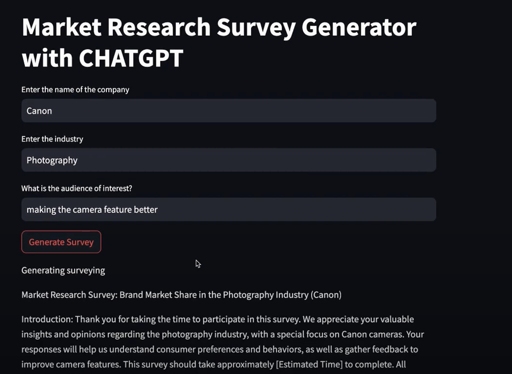

# Market Research ChatGPT

Market Research ChatGPT is an innovative web application designed to streamline the process of generating market research surveys using advanced AI algorithms. This application aids in creating tailored surveys, analyzing market trends, and offering actionable insights, making it an invaluable tool for sales and marketing teams.

## Features

- **AI-Driven Survey Generation**: Automatically generate market research surveys tailored to specific industry needs.
- **Interactive Dashboards**: Dynamic visual representation of data for easy understanding and analysis.
- **Real-Time Data Analysis**: Instantly analyze survey data to identify key consumer trends.
- **Predictive Market Trends**: Utilize AI to forecast future market trends and consumer behavior.
- **User Engagement Metrics**: Track and improve survey engagement for better data collection.

## Getting Started

### Prerequisites

Ensure you have the following installed:
- Python 3.8 or above
- pip (Python package manager)

### Installation

Clone the repository:
```bash
git clone https://github.com/Franklin0603/market-research-survey-chatgpt.git
cd market-research-chatgpt
```

### Run the Streamlit application:
```bash
Copy code
pip install -r requirements.txt
```

### Setting Up Environment Variables
Before running the application, you need to edit the `secret.py` to OpenAI API key. Replace your_openai_api_key_here with your actual OpenAI API key.

```python
#secret.py
OPENAI_API_KEY='your_openai_api_key_here'
```
### Demonstration

Here is a link to a demonstration of how to use the app:
[Market Research ChatGPT Demo](https://www.youtube.com/watch?v=YXh-vqULNuE)

### Preview



### Acknowledgements
- Streamlit
- OpenAI